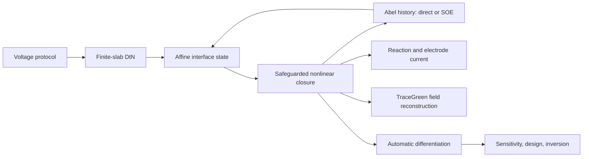

# ProductIntegral-DtN-SOE Mainline

This branch preserves one production mainline method: a zero-training,
spatial-grid-free, causal operator for a layered electrochemical
reaction-diffusion model. It also contains a clearly separated true-3D
curved-film research scaffold; that scaffold is not yet a grid-free claim.

The solver composes four physical pieces:

1. a finite-slab spectral Dirichlet-to-Neumann (DtN) response;
2. singularity-matched ProductIntegration for the external Abel trace;
3. a safeguarded scalar nonlinear reaction closure at every time cell;
4. a near-exact sum-of-exponentials (SOE) backend for fast causal memory.

The NumPy implementation is the forward reference. The float64 PyTorch
implementation differentiates through the same recurrence for sensitivity,
scan-rate design, and parameter inversion. No neural network, checkpoint, or
training data is used.

FDM files are optional and can be supplied only to the posterior comparison
command. Forward simulation and inverse objectives do not import or read FDM.

## Architecture



## Main Files

| File | Role |
|---|---|
| `physical_model.py` | Dimensionless constants and triangular protocol |
| `productintegral_dtn.py` | NumPy reference solver and optional FDM posterior |
| `soe_abel_history.py` | Direct-near/SOE-far Abel memory |
| `differentiable_productintegral_dtn.py` | Differentiable PyTorch recurrence |
| `analyze_delta_forward.py` | Thickness convergence study |
| `analyze_kgdelta_forward.py` | Joint positive-parameter stress audit |
| `benchmark_soe_history.py` | Direct-versus-SOE accuracy and speed |
| `analyze_inverse_identifiability.py` | Local Jacobian/SVD audit |
| `design_multiscan_rates.py` | Scan-rate experiment design |
| `invert_delta_from_cv.py` | Single-parameter thickness inversion |
| `invert_multiscan_parameters.py` | Multi-scan joint inversion |
| `run_colab_mainline.sh` | Single Colab entry point |
| `curved_film_3d.py` | Experimental full-Cartesian curved-film DtN scaffold |
| `run_curved_film_3d.py` | Three-dimensional prototype runner and diagnostics |
| `analyze_curved_film_3d_convergence.py` | Three-level spatial resolution audit |
| `results/curved_film_3d_prototype_results.json` | Frozen initial 3D audit |
| `curved_film_3d_fdm.py` | Posterior-only monolithic 3D FDM/FVM reference |
| `validate_curved_film_3d_fdm.py` | Condensed-operator versus refined-FDM audit |
| `results/curved_film_3d_fdm_validation.json` | Frozen 3D posterior metrics |

## Documentation

- [Physical model and operator factorization](docs/THEORY.md)
- [Stable numerical algorithm](docs/NUMERICAL_METHOD.md)
- [Differentiable inverse problems](docs/INVERSE_PROBLEMS.md)
- [Verified experimental results](docs/RESULTS.md)
- [FDM and related-work comparison](docs/RELATED_WORK.md)
- [Reproduction commands](docs/REPRODUCIBILITY.md)
- [Research and publication roadmap](docs/ROADMAP.md)
- [True-3D curved-film research extension](docs/THREE_DIMENSIONAL_EXTENSION.md)

## Quick Test

```bash
python -m pip install -r requirements.txt
python -m unittest -v \
  test_soe_history.py \
  test_productintegral_dtn.py \
  test_differentiable_operator.py \
  test_multiscan_inversion.py
```

The experimental curved-film branch has an additional independent smoke test:

```bash
python -m unittest -v test_curved_film_3d.py
python -m unittest -v test_curved_film_3d_fdm.py
python run_curved_film_3d.py --output runs_curved_film_3d/prototype
python analyze_curved_film_3d_convergence.py
python validate_curved_film_3d_fdm.py
```

Its Colab entry point is:

```bash
git clone --branch codex/true-3d-curved-film-prototype \
  https://github.com/FanoShannon/pinn_test.git /content/curved_film_3d

OUTPUT_DIR=/content/gdrive/MyDrive/curved_film_3d/prototype \
bash /content/curved_film_3d/run_colab_curved_film_3d.sh
```

## One Colab Entry Point

```bash
git clone --branch codex/productintegral-dtn-soe-mainline \
  https://github.com/FanoShannon/pinn_test.git /content/pi_dtn_soe

MODE=all \
OUTPUT_DIR=/content/gdrive/MyDrive/pi_dtn_soe_mainline \
bash /content/pi_dtn_soe/run_colab_mainline.sh
```

Use `MODE=posterior` with a matching `FDM_PKL` only for an independent FDM
audit. See [reproduction details](docs/REPRODUCIBILITY.md).

## Supported Scope

The current implementation supports positive finite `k_cat`, `gamma`, and
`delta`, arbitrary positive scan rates, constant diffusivities with
`D_A = D_B` and `D_C = D_D`, a reversible Nernst electrode, and a planar
one-dimensional finite-film/half-space geometry.

It is not yet a universal electrochemistry solver. Unequal diffusivities,
finite electron-transfer kinetics, migration, convection, and multidimensional
geometry are explicit research extensions rather than hidden claims.

The curved-film module is intentionally labeled a research prototype. It keeps
all Cartesian coordinates and performs an interface-only nonlinear solve, but
its current DtN responses are generated from sparse volume operators. It is not
yet the boundary-integral, volume-grid-free three-dimensional method described
in the extension roadmap.
